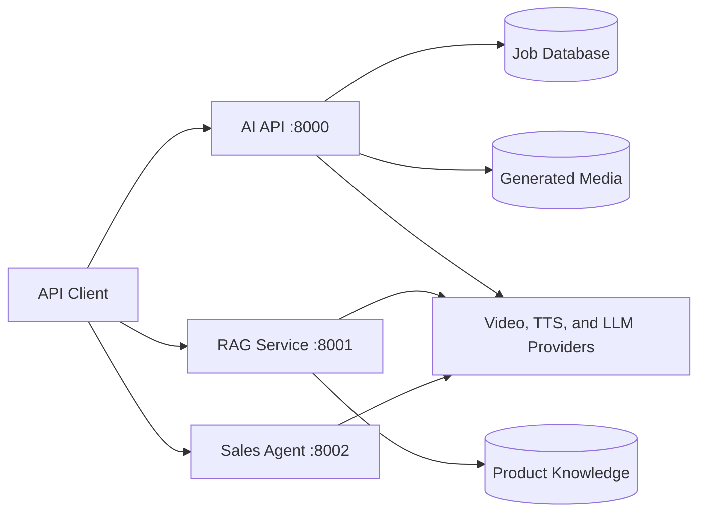

# AI Live-Commerce Platform

[](https://github.com/sea-hackathon-2026/ai-service/actions/workflows/ci.yml)

Backend-only AI platform for live-commerce automation. The monorepo contains
three independently deployable Python services with explicit Clean Architecture
boundaries, isolated dependencies, automated tests, and container delivery.

## Services

| Service | Port | Responsibility |
| --- | ---: | --- |
| AI API | 8000 | Video jobs, text-to-speech, media persistence, and WebSocket streaming |
| RAG service | 8001 | Comment classification, retrieval, and grounded presenter-script generation |
| Sales agent | 8002 | Stateful order collection through Google ADK with model-provider fallback |

The repository deliberately contains no frontend package or npm lockfile. The
previous experimental frontend and its vulnerable PostCSS dependency were
removed because frontend delivery is outside this service's ownership boundary.

## Architecture



Every service applies the same dependency rule:

```text
API transport -> application use cases -> domain models and ports
                                      <- infrastructure adapters
```

- Domain code contains business rules and provider-neutral interfaces.
- Application code coordinates use cases and transaction boundaries.
- Infrastructure code implements databases, storage, retrieval, and model SDKs.
- API code validates transport data and maps application results to HTTP.
- Composition roots select concrete adapters without leaking SDK concerns inward.

See [System Architecture](docs/architecture.md) for component boundaries,
dependency direction, runtime flows, and design decisions.

## Repository Layout

```text
services/
  ai_api/              Media orchestration and async job service
  rag_service/         Retrieval and grounded generation service
  sales_agent/         Conversational sales-closing agent
tests/
  unit/                Domain policies, use cases, and deterministic tools
  integration/         FastAPI wiring and persistence behavior
requirements/          Dependency set per deployable service
notebooks/
  ai_service_colab.ipynb
docs/                  Architecture, AI engineering, API, operations, and CI/CD
.github/workflows/      Continuous integration and container publishing
```

The Colab notebook is the only retained notebook because it is an operational
GPU host for the AI API. Exploratory notebooks are intentionally excluded.

## Quick Start

Use Python 3.11.

```bash
python -m venv .venv
.venv/Scripts/activate
python -m pip install --upgrade pip
pip install -r requirements.txt
```

On macOS or Linux, activate the environment with `source .venv/bin/activate`.
Copy `.env.example` to `.env`, then provide only the credentials required by
the adapters you enable. The populated `.env` file is ignored by Git.

Run each service in a separate terminal:

```bash
uvicorn services.ai_api.main:app --reload --port 8000
uvicorn services.rag_service.main:app --reload --port 8001
uvicorn services.sales_agent.main:app --reload --port 8002
```

Or start the complete backend stack:

```bash
docker compose up --build
```

OpenAPI documentation is available at `/docs`. Set `AI_API_DEBUG=true` to
enable the AI API documentation in development.

## Core API Surface

| Service | Method | Path | Purpose |
| --- | --- | --- | --- |
| AI API | GET | `/health` | Liveness probe |
| AI API | POST | `/v1/video/generate` | Create a video generation job |
| AI API | POST | `/v1/tts/synthesize` | Synthesize speech |
| AI API | GET | `/v1/jobs/{job_id}` | Read job state |
| AI API | WS | `/v1/ws/video/generate` | Stream video generation events |
| RAG | POST | `/v1/retrieval/search` | Retrieve relevant product knowledge |
| RAG | POST | `/v1/scripts/generate` | Generate grounded presenter scripts |
| Sales agent | POST | `/v1/chat` | Continue a stateful sales conversation |
| Sales agent | POST | `/v1/sessions/reset` | Reset conversation state |

The complete request and response contracts are documented in
[API Reference](docs/api-reference.md).

## Quality Gates

```bash
ruff check services tests
python -m compileall -q services tests
pytest -q
```

Tests replace paid model providers with deterministic fakes and use an isolated
SQLite database. The default suite requires no API key or external network call.

## CI/CD

GitHub Actions provides two automated stages:

1. `CI` runs Ruff, bytecode compilation, dependency validation, and the complete
   test suite for pushes and pull requests.
2. `Publish Containers` starts only after CI succeeds on `main`, then builds and
   publishes one image per service to GitHub Container Registry.

Published image names follow this pattern:

```text
ghcr.io/sea-hackathon-2026/ai-service-ai-api
ghcr.io/sea-hackathon-2026/ai-service-rag-service
ghcr.io/sea-hackathon-2026/ai-service-sales-agent
```

Images receive `latest` and immutable `sha-<commit>` tags. Dependabot monitors
Python and GitHub Actions dependencies weekly. See [CI/CD and Release
Operations](docs/ci-cd.md) for triggers, permissions, rollback, and verification.

## Documentation

- [System Architecture](docs/architecture.md)
- [AI and Agent Engineering](docs/ai-engineering.md)
- [API Reference](docs/api-reference.md)
- [Development Guide](docs/development.md)
- [CI/CD and Release Operations](docs/ci-cd.md)
- [Colab GPU Deployment](docs/colab-deployment.md)

## Security

- Secrets are loaded from environment variables and never committed.
- Provider SDKs remain behind domain ports to keep credentials and failures at
  the infrastructure boundary.
- Containers run as an unprivileged user and expose health checks.
- No npm manifest remains in the repository, so the removed PostCSS package is
  not part of the dependency graph or production artifact.
- Dependency updates are proposed by Dependabot and validated by CI before merge.
